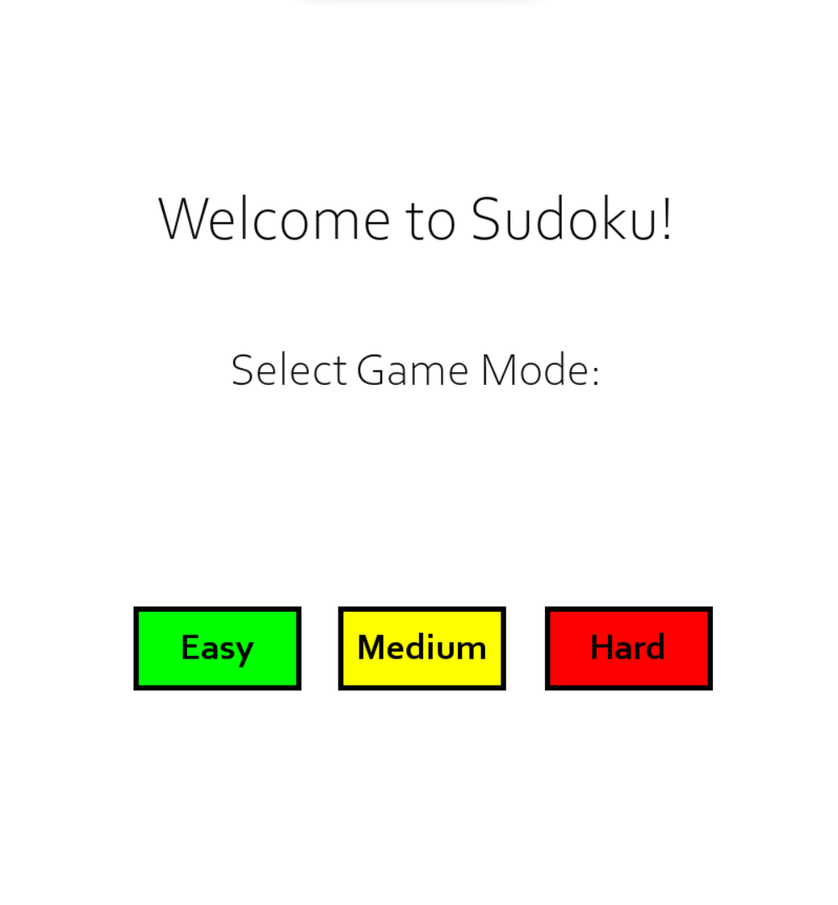
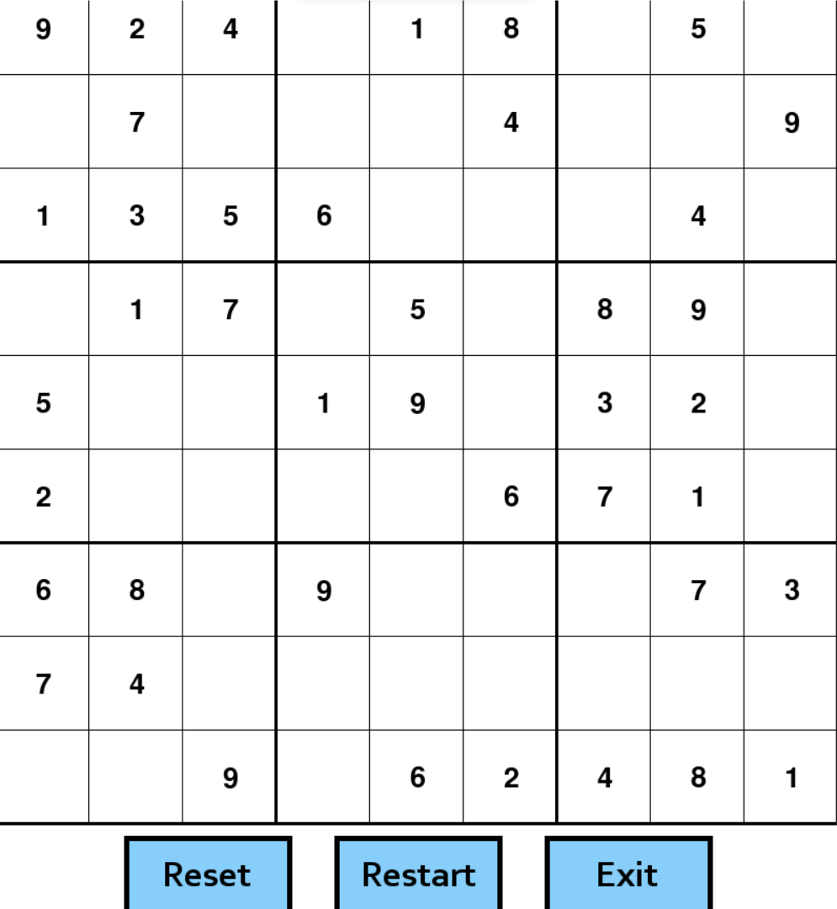

# Sudoku (Python)

The Sudoku game, created using Python and pygame, offers a simple yet enjoyable mouse-click and keyboard input interface.
It features three difficulty levels and handy options like resetting, restarting, and exiting the game. When the board is correctly filled out, a wining screen awaits your victory.

* The program **begins** with a home screen.
* **The home screen** welcomes the user and asks them to **select a difficulty**.
* The difficulties include, **Easy, Medium, and Hard**
* The **harder** the difficulty, the more **empty cells**

  

* During the game, users have **three clickable options**.
* The **Reset Option** clears all cells containing **user-entered** data.
* The **Restart Option** takes users back to the home screen for selecting difficulty.
* The **Exit Option** closes the program.

  

